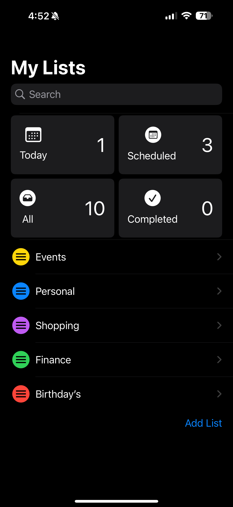
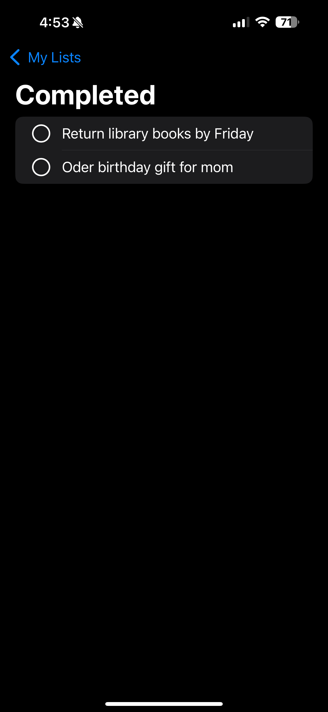
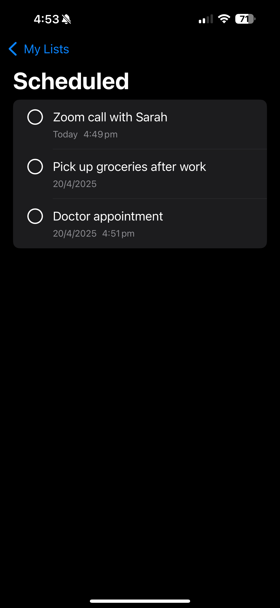
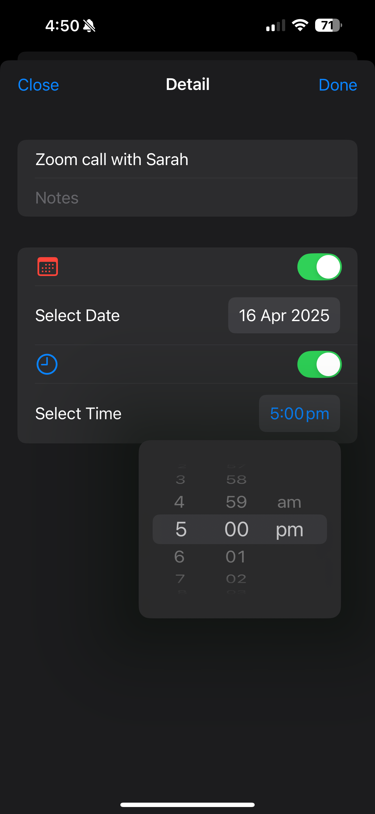
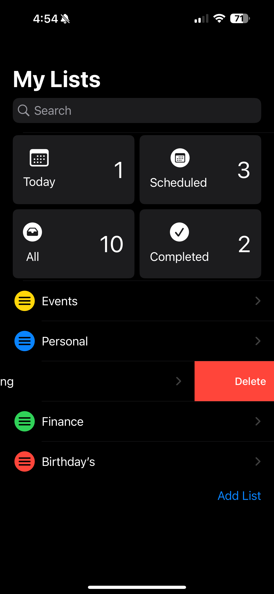

# ReminderApp-iOS
**Reminder App** is a simple and clean reminder management application for iOS, designed with Swift and SwiftUI. It helps users organize their tasks efficiently with notifications and beautiful UI.

---

## ✨ Features

- 🗒️ Create and manage reminders
- 🕒 Set due date and time
- 🔔 Receive local notifications
- 🌙 Light and Dark Mode support
- 🧹 Swipe to delete completed reminders
- 📚 Save reminders locally (CoreData)

---

## 📱 Screenshots

## App Screens

<table>
  <tr>
    <td></td>
    <td></td>
    <td></td>
  </tr>
  </tr>
</table>

<table>
  <tr>
    <td></td>
    <td></td>
    <td></td>
  </tr>
</table>

---

## 🛠 Tools & Technologies

- **Swift 5**
- **SwiftUI**
- **CoreData**
- **UserNotifications**

---

## 📌 Project Status

🚀 Concept and Design Completed  
💻 Code implementation not included in this repository

---

## 🙋‍♀️ About Me

Passionate iOS Developer building clean, user-friendly apps.

📬 Email: jassbhullar1502@gmail.com  

